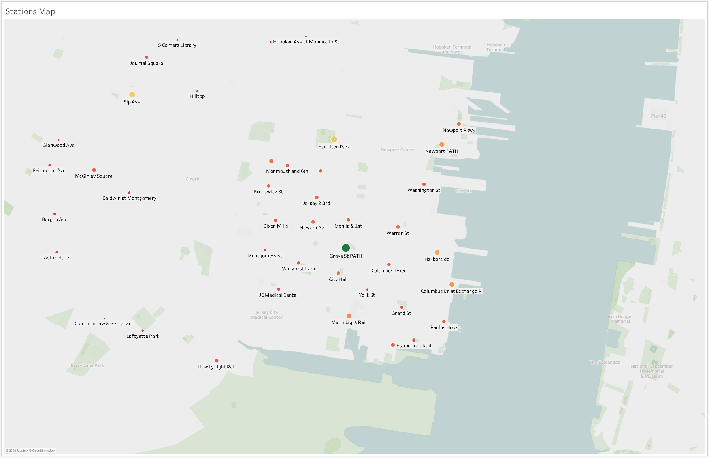
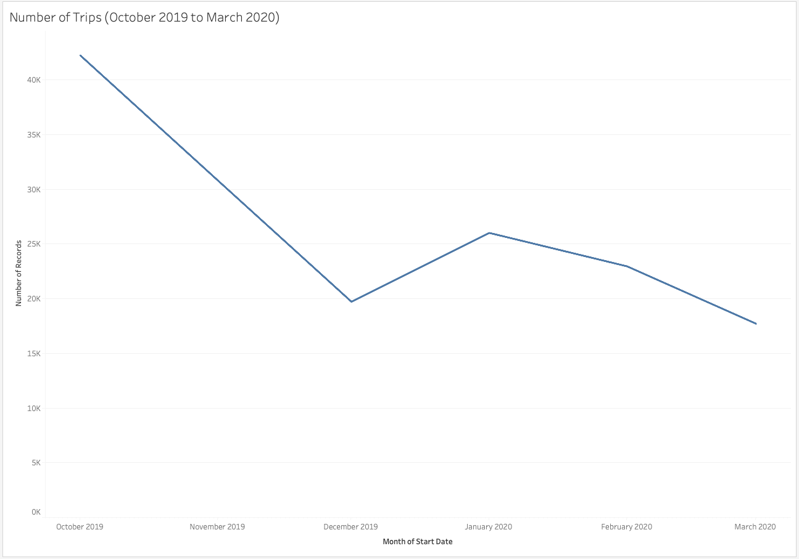
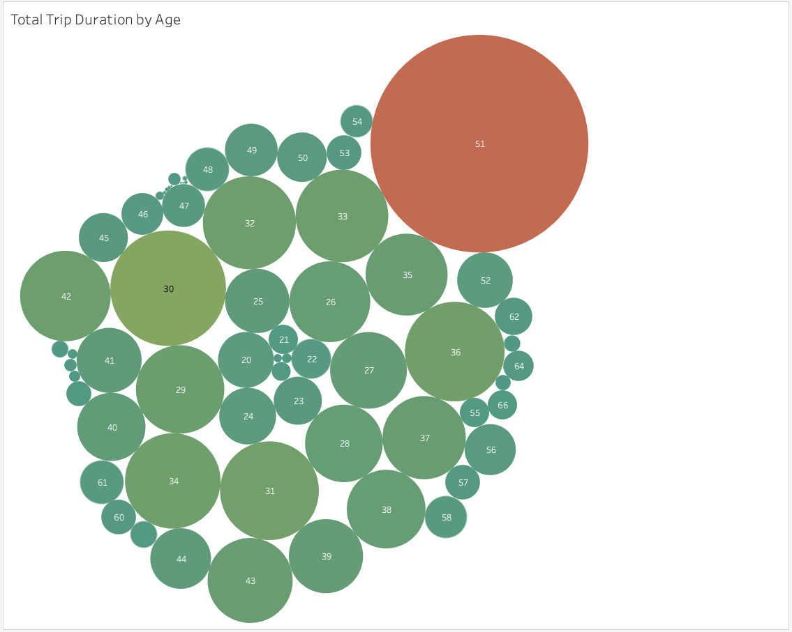
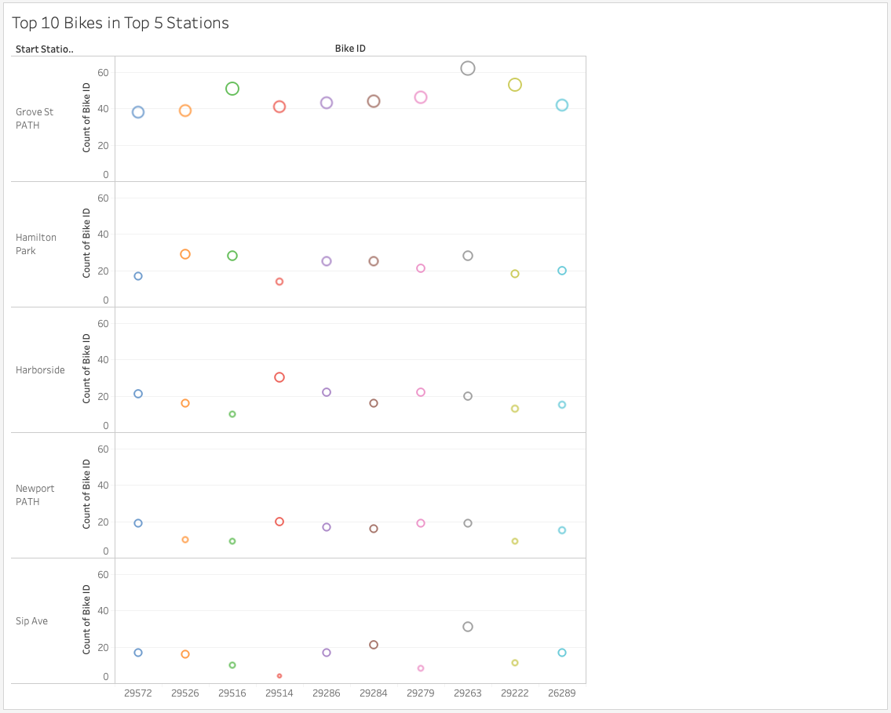
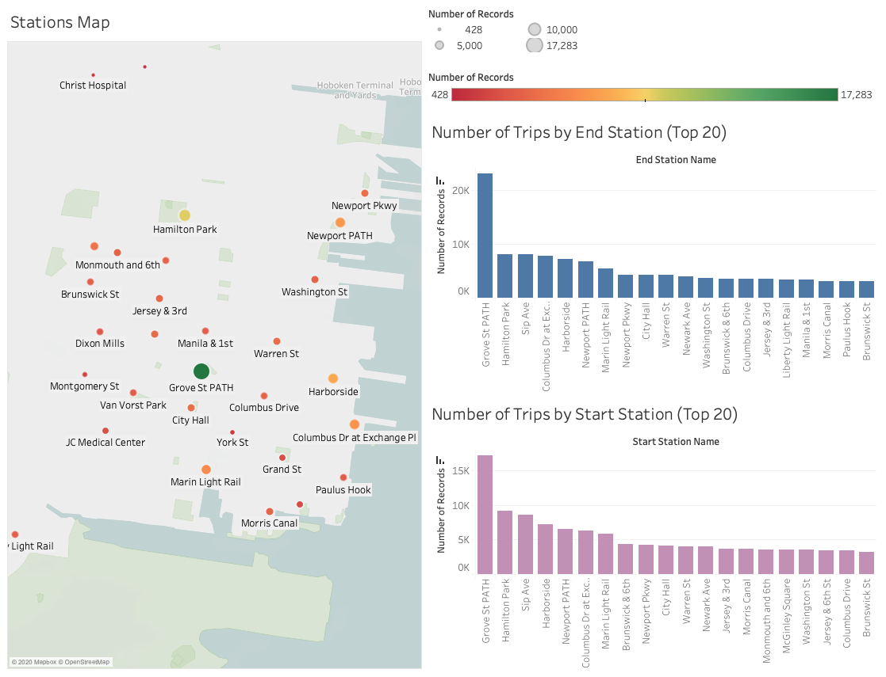
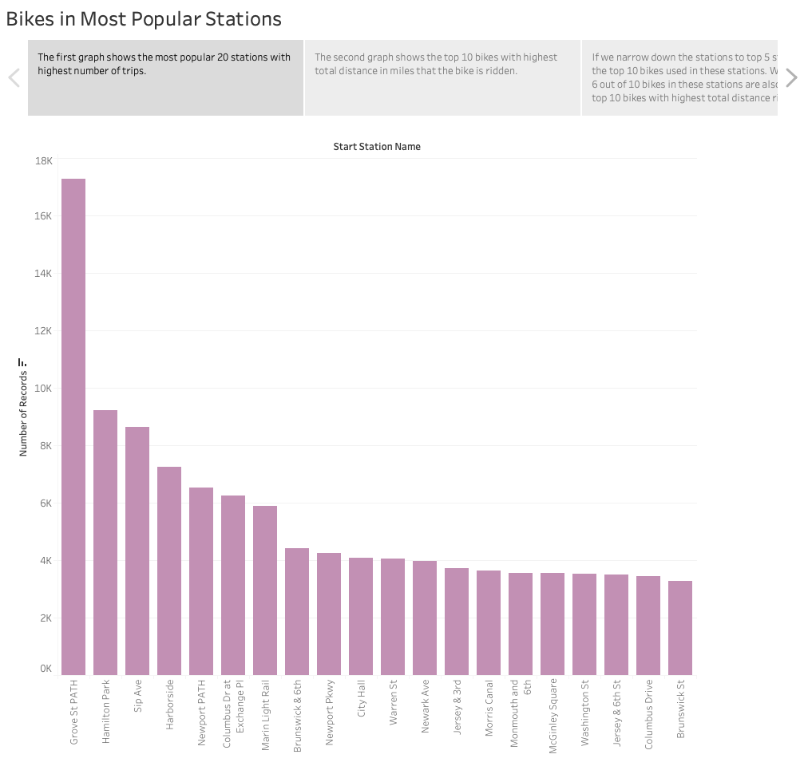

# Citi Bike Analysis and Visualization using Tableau

We will perform analysis on various phenomenons from New York City Bike data and explain it using visualization through Tableau.

Data Source: https://www.citibikenyc.com/system-data
  
## 1. Extract and Clean Data 

- Extract the citibike data from October 2019 to March 2020. 
- Using pandas, we consolidate the data to one csv, replace the gender numerical-label (0, 1, 2) to name-label (Unknown, Male, Female), change all dates to datetime data type, and filter to necessary columns only.
  
## 2. Load the clean data to Tableau for data visualization

Tableau Public Link: https://public.tableau.com/profile/michelle.handipranata#!/vizhome/Citibike_Analysis_15877818021140/BikesinMostPopularStations
  

**Create couple graphs to analyze, find the unique phenomenons of the data, and see the relationships between each columns. Apply the analyis to different types of graphs depending on the relationships (e.g. line, bar, bubble, and map charts).**
  

 

 

 

  
**Create dashboards as a summary of the phenomenons.**
  

  
**Create a story to tell the connections of the findings to the analysis.**
   

 
